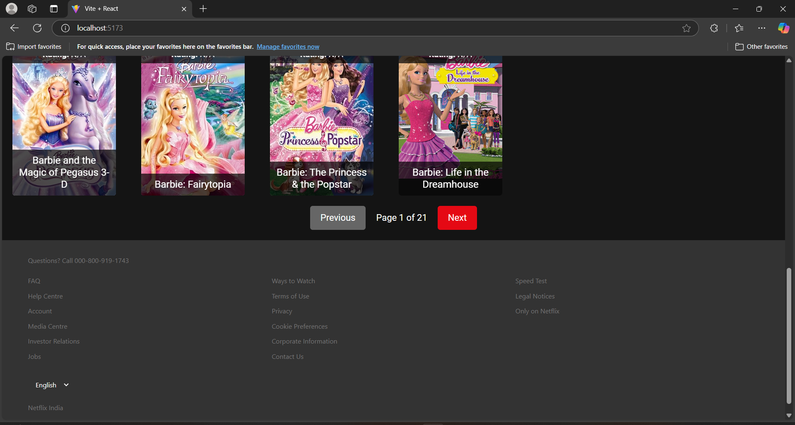

# Netflix Clone Project (Frontend)

## Visual Showcase

This section provides a visual tour of the application, highlighting key features and design elements in a user-flow-centric order.
### 1. Splash Screen

The initial landing page provides an introduction to the application.


### 2. Hero Banner (Homepage)

The Hero section features a prominent movie or show to grab the user's attention upon landing on the homepage.


### 3. Trending Movies (Homepage)

A selection of trending movies available on the platform is showcased on the homepage.
.png)

### 4. New Releases (Homepage)

Discover newly released content on the platform through this section.
.png)

### 5. Search & Filter

The search bar and genre dropdown allow users to quickly find specific movies or browse by category.


### 5.1. Search & Filter

Genre dropdown allow users to quickly find specific movies.
.png)

### 6. Pagination

Navigation through multiple pages of content is facilitated using pagination.


### 7. Movie Details

A dedicated page provides in-depth information about a selected movie, including its description, cast, and more.


### 8. Add to Favorite Button

Users can add movies to their personal favorites list using this button.


### 9. Favorites Page

A view of the dedicated favorites page, displaying the collected movies.


### 10. Kids Section

A dedicated section features content suitable for children.


### 11. TV Shows Section

A dedicated section features tv shows.


### 12. Light Mode Interface

The application offers a light mode interface for user preference.


## Project Overview

This project develops a movie streaming platform replicating the frontend experience of Netflix. The platform allows users to browse movies, view details, search, filter by categories, curate personalized favorite lists, and seamlessly toggle between light and dark viewing modes. This is a purely frontend focused application.

## Technologies Used

React, React Router, HTML, CSS, Bootstrap, JavaScript, OMDB API

## Description

This project is a Netflix Clone (Frontend Only) where a fully responsive and dynamic movie streaming UI is developed. The project focuses on building an interactive and visually appealing web application using React, JavaScript, HTML, CSS, and Bootstrap. The application allows users to: Browse movie listings, View movie details, Search for movies, Filter by genre, Add movies to a favorites list, Switch between light/dark mode.

## Project Goals

*   Craft a visually appealing and responsive UI that adheres to industry standards.
*   Dynamically render movie content using efficient JavaScript techniques.
*   Implement seamless navigation using React Router.
*   Provide persistent storage of favorite movies using LocalStorage.
*   Elevate user experience through a dynamic dark mode toggle.
*   Successfully deploy the project on Netlify or Vercel.

## Features & Functionalities

Homepage (Movie Dashboard): Hero Spotlight: A captivating banner showcasing the latest or featured movie. Movie Grid: A visually organized grid displaying movies with engaging images, titles, and ratings. Effortless Navigation: Clicking a movie card directs users to the dedicated Movie Details Page.

Navigation & Routing: Intuitive Navbar: A top navigation bar providing easy access to the Home, Favorites, and Search functionalities. Seamless Transitions: Utilizes React Router for smooth, single-page application-like navigation.

Movie Details Page: Comprehensive Information: Displays the movie's title, captivating description, associated genres, release date, and viewer rating. Personalized Action: An "Add to Favorites" button to easily curate a personal movie list.

Favorites Page: Curated Collection: A dedicated page displaying a user's saved favorite movies. Easy Management: Allows users to effortlessly remove movies from their favorites list. Persistent Data: Leverages LocalStorage to retain user data even after a browser refresh.

Search & Filter Functionality: Intelligent Search: A dynamic search bar enables users to quickly find movies by title. Categorized Browsing: A genre filter dropdown empowers users to refine their search by specific movie categories. Real-time Updates: The movie listings respond dynamically to search and filter inputs, providing a fluid browsing experience.

Dark Mode Toggle: Personalized Viewing: A dedicated button facilitates seamless switching between light and dark themes. Context API Implementation: The React Context API ensures a consistent theme across the application.

UI/UX Enhancements: Interactive Movie Cards: Engaging hover effects on movie cards enhance user interaction. Fluid Transitions: Carefully implemented animations & transitions create a polished and seamless experience. Loading Indicator: A visually clear loading spinner indicates data fetching activity.

Fully Responsive Design: Cross-Device Compatibility: A consistent and optimized experience across mobile phones, tablets, and desktop computers. Adaptive Layout: Employs Bootstrap Grid and CSS media queries to achieve a responsive layout.

Deployment: Cloud Hosting: The project is deployed on Vercel (or Netlify). Open Source: Access the complete source code on the shared GitHub repository.

## Installation (Prerequisites)

*   Node.js (version >= 16)
*   npm (or yarn)
*   Bootstrap
## Setup & Installation

1.  Clone the repository:

    ```bash
    git clone https://github.com/pratheeksha2004/netflix-clone.git
    ```

2.  Navigate to the project directory:

    ```bash
    cd netflix-clone
    ```

3.  Install dependencies:

    ```bash
    npm install
    ```
    
Add your API key:

OMDB_API_KEY=YOUR_API_KEY (8e88baf0)

Please respect the use of this demonstration version.

Running the Application

npm run dev

Browse to http://localhost:5173 in your browser.(default port)

Building for Production

npm run build

This will create a /dist folder with production code.

Project Structure


## Project Structure

The project's directory structure is organized as follows:

| Directory/File          | Description                                                                 |
|--------------------------|-----------------------------------------------------------------------------|
| `Netflix-Clone/`        | Root directory of the project                                              |
| `src/`                  | Contains all the source code                                                |
| `src/components/`        | Reusable React components                                                  |
| `src/components/Favorites.jsx`  | Displays list of favorite movies                                     |
| `src/components/Favorites.css`  | Styles for Favorites component                                         |
| `src/components/Footer.jsx`     | Footer component                                                        |
| `src/components/Footer.css`     | Styles for Footer component                                                        |
| `src/components/LoadingSpinner.jsx` | Loading indicator component                                           |
| `src/components/MovieCard.jsx`  | Individual movie display component                                      |
| `src/components/MovieDetails.jsx` | Displays details for a specific movie                                  |
| `src/components/MovieDetails.css` | Styles for MovieDetails component                                      |
| `src/components/Navbar.jsx`       | Navigation bar component                                                 |
| `src/components/Navbar.css`       | Styles for Navbar component                                                 |
| `src/components/SearchBar.jsx`    | Search bar component                                                    |
| `src/components/SplashScreen.jsx` | Splash screen component                                                |
| `src/components/SplashScreen.css` | Styles for SplashScreen component                                        |
| `src/components/ThemeToggle/`   | Theme toggle component                                                 |
| `src/components/ThemeToggle/ThemeToggle.jsx` | Theme toggle logic and UI                                          |
| `src/contexts/`         | Contains React context files                                              |
| `src/contexts/ThemeContext.jsx`| Manages dark/light theme context                                       |
| `src/pages/`             | Contains different pages of the application                               |
| `src/pages/Home.jsx`        | Main movie dashboard                                                      |
| `src/pages/Home.css`        | Styles for Home component                                                      |
| `src/pages/Kids.jsx`        | Page for kids' movies                                                    |
| `src/pages/Kids.css`        | Styles for Kids component                                                    |
| `src/pages/KidsData.js`     | Data for kids' movies                                                      |
| `src/pages/movieData.js`    | Data for movie genres                                                      |
| `src/pages/SearchResults.jsx`| Displays search results                                                  |
| `src/pages/SearchResults.css`| Styles for SearchResults component                                          |
| `src/pages/TVShows.jsx`     | Page for TV shows                                                        |
| `src/pages/TVShows.css`     | Styles for TVShows component                                                |
| `src/service/`           | Contains API service files                                                |
| `src/service/apiService.js`| Handles API calls to OMDB API                                             |
| `src/assets/`            | Contains static assets                                                       |
| `src/assets/`           | Directory for logo images (some .png files)                               |
| `App.jsx`               | Top-level component                                                        |
| `App.css`               | Global CSS styles                                                                  |
| `main.jsx`              | Entry point for React                                                        |
| `public/`               | Contains static assets (e.g., images, fonts)                               |
| `.gitignore`            | Specifies intentionally untracked files                                    |
| `README.md`             | Instructions and project info (this file)                                 |
| `package.json`          | Project metadata and dependencies                                           |
| `vite.config.js`        | Vite build configuration file                                              |


Coding & Naming Conventions
Indentation: 2 spaces

React components: PascalCase (e.g., MovieCard)

Variables and functions: camelCase (e.g., fetchData, searchTerm)

CSS classes: kebab-case (e.g., movie-card, search-bar)

## API Documentation

This application uses the OMDb API (https://www.omdbapi.com/) to fetch movie and TV show data.  The following methods are available in the `apiService`:

**Note:**  Replace `8e88baf0` with your actual OMDb API key. **Please use it responsibly and respect its usage limits.** Avoid making excessive requests or any actions that could harm the service.

### 1. `getMovieDetails(id)`

*   **Description:** Retrieves detailed information about a specific movie or TV show by its IMDb ID.
*   **Parameters:**
    *   `id` (string): The IMDb ID of the movie or TV show (e.g., `"tt0816692"` for Interstellar).
*   **Returns:**
    *   (Promise<object>): A promise that resolves to an object containing the movie or TV show details.  The object structure is defined by the OMDb API.
*   **Example:**

    ```javascript
    apiService.getMovieDetails('tt0816692')
      .then(data => {
        console.log(data); // Output: Movie details for Interstellar
      })
      .catch(error => {
        console.error(error);
      });
    ```

### 2. `searchMovies(searchTerm, page = 1)`

*   **Description:** Searches for movies based on a search term.
*   **Parameters:**
    *   `searchTerm` (string): The search term (e.g., `"Avengers"`).
    *   `page` (number, optional): The page number of the results (default: 1).
*   **Returns:**
    *   (Promise<object>): A promise that resolves to an object containing the search results. The object structure from OMDb API is followed.
        *   `Search` (array): An array of movie objects matching the search term. Each movie object contains:
            *   `Title` (string): The title of the movie.
            *   `Year` (string): The year the movie was released.
            *   `imdbID` (string): The IMDb ID of the movie.
            *   `Type` (string): The type of result (e.g., `"movie"`).
            *   `Poster` (string): URL of the movie poster.
        *   `totalResults` (string): The total number of results for the search.
        *   `Response` (string): `"True"` if the request was successful, `"False"` otherwise.
        *   `Error` (string, optional): If `Response` is `"False"`, this field will contain the error message.
*   **Example:**

    ```javascript
    apiService.searchMovies('Avengers', 2)
      .then(data => {
        console.log(data.Search); // Output: Array of movies on page 2
      })
      .catch(error => {
        console.error(error);
      });
    ```

### 3. `searchTVShows(searchTerm, page = 1)`

*   **Description:** Searches for TV shows based on a search term.
*   **Parameters:**
    *   `searchTerm` (string): The search term (e.g., `"Breaking Bad"`).
    *   `page` (number, optional): The page number of the results (default: 1).
*   **Returns:**
    *   (Promise<object>): A promise that resolves to an object containing the search results (same structure as `searchMovies`, but with `Type` being `"series"`).
*   **Example:**

    ```javascript
    apiService.searchTVShows('Breaking Bad')
      .then(data => {
        console.log(data.Search); // Output: Array of TV shows
      })
      .catch(error => {
        console.error(error);
      });
    ```

### 4. `getTrendingMovies()`

*   **Description:** Retrieves a list of trending movies.  *Note: This currently uses a hardcoded list of IMDb IDs for demonstration purposes.*
*   **Parameters:** None
*   **Returns:**
    *   (Promise<array>): A promise that resolves to an array of movie objects (same structure as `getMovieDetails`).
*   **Example:**

    ```javascript
    apiService.getTrendingMovies()
      .then(movies => {
        console.log(movies); // Output: Array of trending movie details
      })
      .catch(error => {
        console.error(error);
      });
    ```

### 5. `getNewReleases()`

*   **Description:** Retrieves a list of new movie releases. *Note: This currently simulates new releases by searching for movies from the current year and limiting the results.*
*   **Parameters:** None
*   **Returns:**
    *   (Promise<array>): A promise that resolves to an array of movie objects (same structure as the `Search` array from `searchMovies`).
*   **Example:**

    ```javascript
    apiService.getNewReleases()
      .then(newReleases => {
        console.log(newReleases); // Output: Array of new release movies
      })
      .catch(error => {
        console.error(error);
      });
    ```

---

**Important Considerations:**

*   **OMDb API Rate Limits:**  Be aware of the OMDb API's rate limits and implement appropriate error handling and caching to avoid exceeding them.
*   **Data Structure:** Refer to the OMDb API documentation for the exact structure of the data returned by each endpoint.  The structures described above are based on your code and may need adjustment.
*   **Error Handling:** Include error handling in your code to gracefully handle API errors. The provided code includes basic error handling with `try...catch` blocks.
*   **Hardcoded Data:** The `getTrendingMovies` and `getNewReleases` functions use hardcoded data or simulations. Replace these with a real implementation if you want to fetch actual trending or new release data.

Responsiveness Screenshots for different Screens
Mobile
A movie streaming app on a phone
.png)

Tablet
Screenshot of app running on tablet
.png)

Desktop
Screen shot of app running on desktop
.png)

UI/UX Design Principles
Minimalist design

Clear typography

Consistent experience across devices

Debugging & Troubleshooting
Browser dev tools

console.log tracking

Error Management
Implemented API error handling

Displayed user-friendly messages

## Deployment Strategy

This project is deployed on [Vercel](https://vercel.com/) for instant availability. You can view the live application at:

[Updated Netflix Clone](https://updated-netflix-clone-rau7b1tfh-pratheeksha-k-ns-projects.vercel.app/)

## Performance Considerations

This application was designed with performance in mind.  I have employed the following strategies to ensure a fast and responsive user experience:

*   **React.memo for Memoization:** I utilize `React.memo` to optimize the rendering of functional components.  By memoizing components, It prevents unnecessary re-renders when the input props remain unchanged.  This significantly reduces the workload on React, especially for computationally intensive components or components that are frequently re-rendered.

*   **Lazy Loading with `React.lazy` and `Suspense`:**  To minimize the initial load time, I implement lazy loading for images, components, and modules that are not immediately required.  This is achieved using `React.lazy` in conjunction with `Suspense` to display fallback content while the lazy-loaded components are being fetched.  This improves perceived performance and reduces the time to interactive.

*   **Code Splitting:** I leverage code splitting to divide the application into smaller, more manageable bundles. This allows the browser to download only the code that is necessary for the current route or feature, reducing the initial download size and improving load times.

## Performance Analysis (Lighthouse)

This section summarizes the performance analysis of the application using Google Lighthouse. The scores and metrics provide insights into areas for potential optimization.

### Scores

*   **Performance:** 68/100 (Medium)
*   **Accessibility:** 100/100
*   **Best Practices:** 100/100
*   **SEO:** 83/100

### Key Metrics

*   **First Contentful Paint (FCP):** 1.9 s
*   **Largest Contentful Paint (LCP):** 3.5 s
*   **Total Blocking Time (TBT):** 0 ms
*   **Cumulative Layout Shift (CLS):** 0 ms
*   **Speed Index:** 2.5 s
